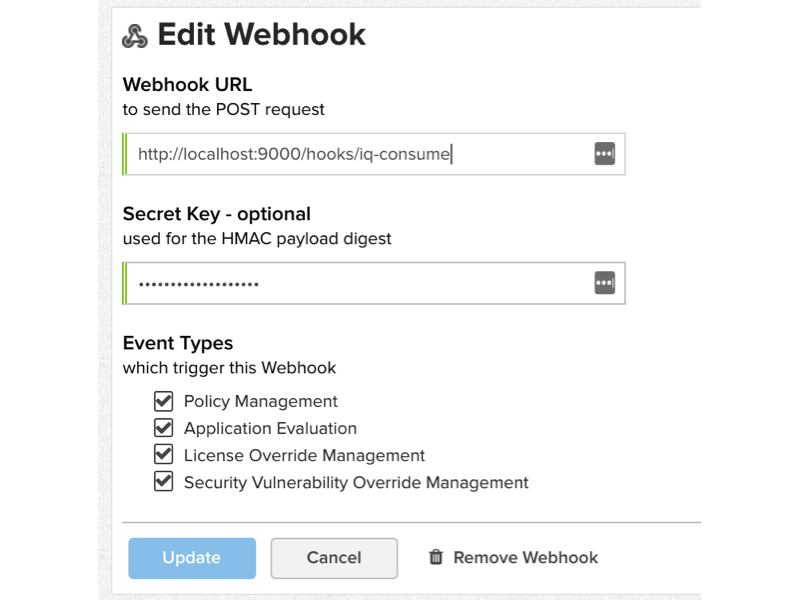
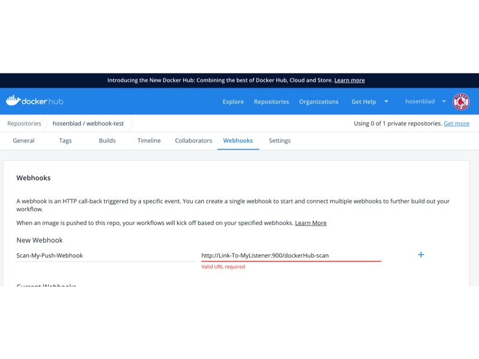
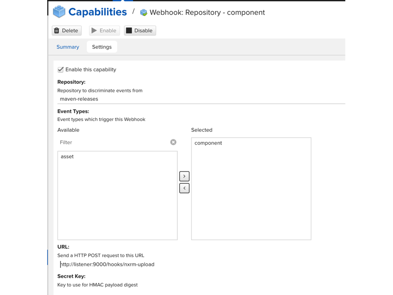

# WebHook Integrations for Nexus Platform

To contribute back your own extensions please fork and submit a PR! For Questions feel free to reach out to - moose@sonatype.com?

There are a couple of different ways to deploy the IQ-Webhooks piece.  You can deploy it locally on a VM via a local go install or using a Docker Image.  This guide will cover both.  

## What is this?

This is a basic webhook listener that will consume events, and perform an IQ Lifecycle scan.  There is a listener configured to receive the IQ Server Scan response for future integrations. You will need to enable the [Automatic Applications feature in IQ Server](https://help.sonatype.com/iqserver/managing/application-management/managing-automatic-applications#app)

## What to download? 

You will need to download a copy of the Nexus IQ CLI Scanner - available here - https://download.sonatype.com/clm/server/latest.tar.gz
If you are running outside of docker you will need go runtime installed.

## Local Install

Webhooks project from here - https://github.com/adnanh/webhook - once you follow these installation instructions you will need to ensure the webhook's is on your path. This has bit a couple of folks.

### Hooks & Scripts from this repository
/hooks /scripts directories contain boiler plates starters.  If you build your own and would like to contribute them back please submit a PR!

## Docker Image

The Dockerfile in this repository will allow you to build an image that will package in the scripts and hooks included here.  
```
docker build -t webhook-listener:test .
```

If you would like to run this quickly here is a docker run command for you to use to get this up and running. 

### Run a Docker Image 
```
docker run -d -p 9000:9000 \
	-it -v /var/run/docker.sock:/var/run/docker.sock -v /usr/local/bin/docker:/usr/bin/docker \
	--name=webhook hosenblad/webhook-test:my-webhook-test \
	-verbose \
	-hotreload \
	-hooks=/etc/webhook/hooks.json \
	-hooks=/etc/webhook/test-docker-iq-hook.json;
```
If you'd like to use this with Docker Compose here an a start snippet for you to include to get started

### Docker Compose
```
 listener:
    container_name: webhook-listener
    image: webhook-listener:test
    volumes:
      - /usr/local/bin/docker:/usr/bin/docker
      - /var/run/docker.sock:/var/run/docker.sock
    ports:
      - "9000:9000"
    command:
       - -verbose 
       - -hotreload
       - -hooks=/etc/webhook/test.json
       - -hooks=/etc/webhook/dockerHub-scan.json
       - -hooks=/etc/webhook/nxrm-consume.json
       - -hooks=/etc/webhook/iq-consume.json
    links:
      - iq-server      
```

### Configure IQ Server Webhook

In order to configure the IQ Server to have a webhook back to this listener you could 


### Configuring DockerHub Webhook



### Configuring NXRM Webhook

